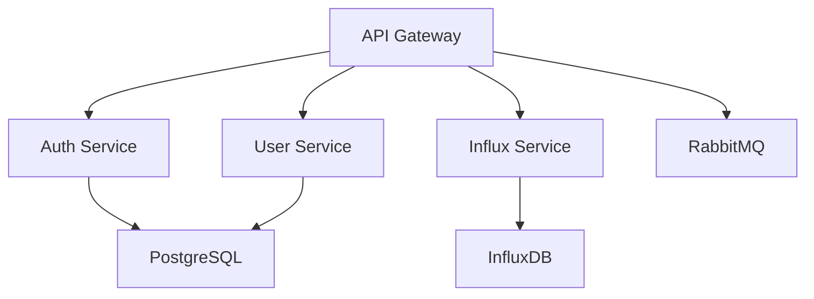

# 🏗️ Architecture des Packages - PFE Backend

## 📋 Vue d'ensemble

Le projet PFE Backend utilise une architecture modulaire avec des packages séparés pour différents services. Cette approche permet une meilleure organisation du code et facilite la maintenance.

## 📦 Structure des Packages

```
packages/
├── api-gateway/          # Point d'entrée principal
├── auth-service/         # Service d'authentification
├── user-service/         # Service de gestion des utilisateurs
├── influx-service/       # Service de données temps réel
└── shared/               # Code partagé entre services
```

## 🔐 API Gateway (`packages/api-gateway/`)

### Responsabilités
- **Point d'entrée** principal de l'application
- **Authentification** et autorisation JWT
- **Routage** des requêtes vers les services appropriés
- **Validation** des données entrantes
- **Gestion des erreurs** centralisée

### Composants
- `auth/guards/` : Guards NestJS pour la sécurité
- `influx/` : Intégration avec le service InfluxDB
- `users/` : Gestion des utilisateurs

### Endpoints principaux
- `POST /auth/login` : Connexion utilisateur
- `POST /auth/register` : Inscription utilisateur
- `GET /users/profile` : Profil utilisateur (protégé)
- `POST /influx/data` : Envoi de données InfluxDB

## 🔑 Auth Service (`packages/auth-service/`)

### Responsabilités
- **Gestion des utilisateurs** et comptes
- **Authentification** JWT
- **Hachage** des mots de passe
- **Validation** des données d'authentification

### Composants
- `auth/` : Logique d'authentification
- `dto/` : Data Transfer Objects pour l'auth
- `prisma/` : Accès à la base de données

### Fonctionnalités
- Inscription et connexion utilisateur
- Génération et validation de tokens JWT
- Gestion des sessions
- Sécurité des mots de passe avec bcrypt

## 👥 User Service (`packages/user-service/`)

### Responsabilités
- **Gestion des profils** utilisateur
- **CRUD** des informations utilisateur
- **Validation** des données utilisateur
- **Gestion des permissions**

### Composants
- `users/` : Logique métier utilisateur
- `dto/` : DTOs pour les utilisateurs
- `prisma/` : Accès à la base de données

### Fonctionnalités
- Création et mise à jour de profils
- Gestion des informations personnelles
- Contrôle d'accès basé sur les rôles
- Validation des données utilisateur

## 📊 Influx Service (`packages/influx-service/`)

### Responsabilités
- **Gestion des données** temps réel
- **Intégration InfluxDB** pour les métriques
- **Traitement** des données de capteurs
- **API** pour l'envoi et la récupération de données

### Composants
- `influx/` : Logique métier InfluxDB
- `main.ts` : Point d'entrée du service

### Fonctionnalités
- Envoi de données vers InfluxDB
- Récupération de métriques temps réel
- Agrégation et traitement des données
- Gestion des buckets et organisations

## 🔄 Shared Package (`packages/shared/`)

### Responsabilités
- **Interfaces** communes entre services
- **DTOs** partagés
- **Constantes** globales
- **Types** TypeScript communs

### Composants
- `constants/` : Constantes partagées
- `dto/` : DTOs communs
- `interfaces/` : Interfaces TypeScript

### Avantages
- **Réutilisabilité** du code
- **Cohérence** entre services
- **Maintenance** simplifiée
- **Évite la duplication** de code

## 🌐 Communication entre Services

### Architecture actuelle
- **Monolithique** avec packages séparés
- **Communication directe** via imports
- **Base de données partagée** (PostgreSQL)
- **Services externes** (RabbitMQ, InfluxDB)

### Évolution possible vers microservices


## 🔧 Configuration des Packages

### Dépendances partagées
Chaque package peut avoir ses propres dépendances dans `package.json` :

```json
{
  "dependencies": {
    "@nestjs/common": "^10.0.0",
    "@nestjs/core": "^10.0.0"
  }
}
```

### Scripts de build
```bash
# Build de tous les packages
npm run build

# Build d'un package spécifique
cd packages/auth-service && npm run build
```

## 🚀 Déploiement

### Option 1 : Déploiement monolithique (actuel)
- Tous les packages sont déployés ensemble
- Utilise `docker-compose.yml`
- Plus simple à gérer

### Option 2 : Déploiement microservices (futur)
- Chaque package déployé séparément
- Communication via RabbitMQ ou HTTP
- Plus scalable mais plus complexe

## 📈 Avantages de cette Architecture

### ✅ Points forts
- **Modularité** : Code organisé par fonctionnalité
- **Maintenabilité** : Facile de modifier un service
- **Réutilisabilité** : Code partagé entre services
- **Testabilité** : Tests isolés par package
- **Évolutivité** : Possibilité de migrer vers microservices

### ⚠️ Points d'attention
- **Couplage** : Services encore couplés via imports
- **Complexité** : Plus de fichiers à gérer
- **Dépendances** : Gestion des versions entre packages

## 🔮 Évolutions futures

### Court terme
- Améliorer la séparation des responsabilités
- Ajouter des tests d'intégration
- Documenter les APIs de chaque service

### Long terme
- Migration vers une vraie architecture microservices
- Communication asynchrone via RabbitMQ
- Déploiement indépendant des services
- Monitoring et observabilité avancés

## 📚 Ressources

- [Documentation NestJS](https://docs.nestjs.com/)
- [Guide des modules](https://docs.nestjs.com/modules)
- [Architecture des microservices](https://docs.nestjs.com/microservices/basics)
- [Prisma ORM](https://www.prisma.io/docs/)
- [InfluxDB Client](https://docs.influxdata.com/influxdb/v2.7/client-libraries/nodejs/)

---

**Cette architecture évolue avec le projet. Consultez régulièrement ce document pour les mises à jour.** 🚀
